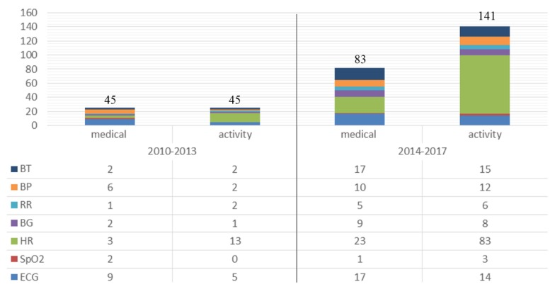
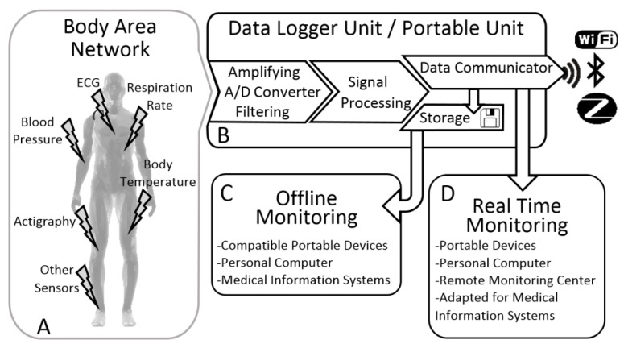
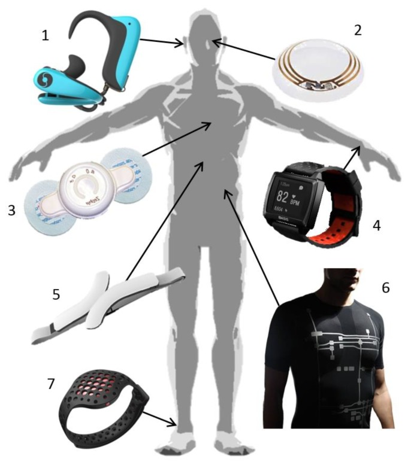

## Use Case
Wearable Health Devices (WHDs)的应用可以归为以下三类：
* 应用场景: Home/Remote + Clinical
* 监控类型: Online + Offline
* 用户类型: Healthy + Patient

1. Activity - 可以运用BAM (Business Activity Monitoring), 监控实时状态，建立个人档案，分析基于不同个体的均值，从而在出现异常值时可以预警。
2. Prediction - 可以运用机器学习，基于历史数据，训练数据模型，用于预测未来异常，辅助医生诊断。
3. Anomaly Detection - 可以基于Online的实时监控或者Offline的数据模型，识别异常pattern，从而提供预警。
4. Diagnosis Support - 用于医生介入，比如预约医生。

## Vital Signs
实时监控指标，包括以下7个：
* BT (Body Temperature): 体温
* BP (Blood Pressure): 血压
* RR (Respiration Rate): 呼吸率
* BG (Blood Glucose): 血糖
* HR (Heart Rate): 心率
* SpO2 (Blood Oxygen Saturation): 血氧饱和度
* ECG (Electrocardiogram): 心电图

## Generic Architecture

## One Example
1. SensoTRACK ear sensor
2. Google Contact Lens
3. BioPatch
4. Smartwatch Basis PEAK
5. QardioCore
6. Vital Jacket T-shirt
7. Moov (Activity Tracker)

## Reference
* [Wearable Health Devices—Vital Sign Monitoring, Systems and Technologies](https://www.ncbi.nlm.nih.gov/pmc/articles/PMC6111409/)
