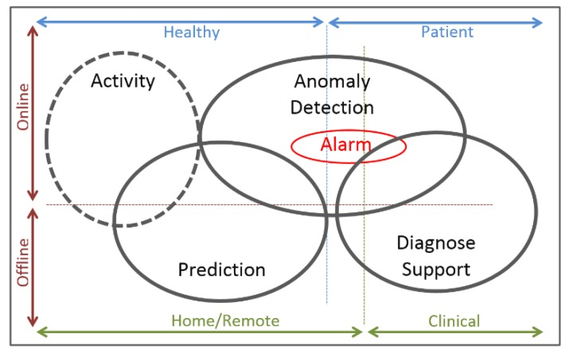

## Use Case
Wearable Health Devices (WHDs)的应用可以归为以下三类：
* 应用场景: Home/Remote + Clinical
* 监控类型: Online + Offline
* 用户类型: Healthy + Patient

1. Activity - 可以运用BAM技术(Business Activity Monitoring), 监控实时状态，建立个人档案，分析基于不同个体的均值，从而在出现异常值时可以预警。
2. Prediction - 可以基于历史数据，计算数据模型，用于预测未来异常，辅助医生诊断。
3. Anomaly Detection - 用于识别异常pattern，从而提供预警。
4. Diagnosis Support - 用于医生介入，比如预约医生。

## Reference
* [Wearable Health Devices—Vital Sign Monitoring, Systems and Technologies](https://www.ncbi.nlm.nih.gov/pmc/articles/PMC6111409/)
